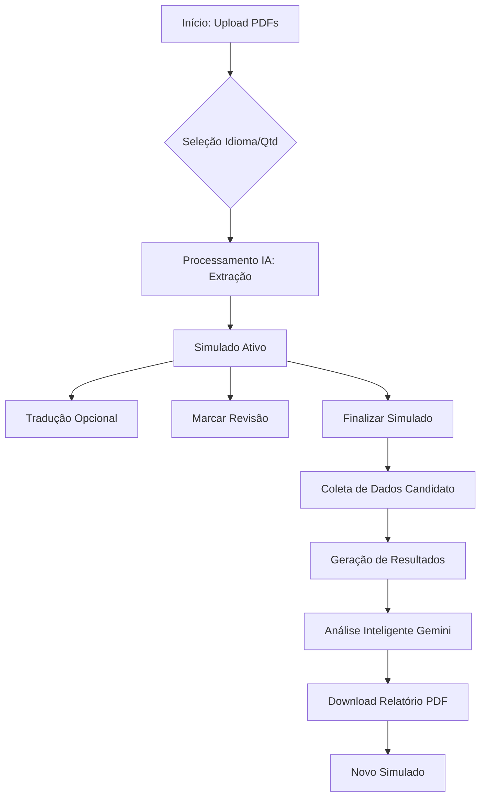

# Documentação Técnica - CertaCloud AWS Simulator

## 1. Estrutura de Componentes e Funcionalidades

### Componentes Principais (`App.tsx`)
- **Header**: Exibe o logotipo CertaCloud e o cronômetro durante o simulado.
- **Idle State (Home)**: 
  - Upload de arquivos (Guia do Exame e Banco de Questões).
  - Seleção de idioma (PT/EN).
  - Seleção de quantidade de questões (10, 30, 60).
- **Loading State**: Feedback visual enquanto a IA processa os PDFs.
- **Welcome State**: Resumo das regras antes de iniciar o cronômetro.
- **Simulating State**: 
  - Interface de questões com navegação (Anterior/Próxima).
  - Funcionalidade de "Marcar para Revisão".
  - Sidebar de progresso para navegação rápida entre questões.
  - **Tradutor On-Demand**: Tradução instantânea da questão atual via IA.
- **Collecting Info State**: Formulário para capturar Nome e Idade do candidato após o término.
- **Results State**: 
  - Dashboard de performance (Score, Tempo, Acertos).
  - **Análise Inteligente**: Relatório detalhado gerado pela IA com mapeamento de domínios AWS.
  - **Exportação PDF**: Geração de relatório oficial em PDF usando `jspdf` e `html2canvas`.

### Serviços (`src/services/gemini.ts`)
- `parseExamGuide`: Extrai domínios e pesos do PDF oficial da AWS.
- `parseQuestionBank`: Extrai e formata questões do banco de dados em PDF.
- `translateQuestion`: Traduz questões individualmente mantendo termos técnicos.
- `analyzeResults`: Gera o feedback pedagógico final baseado no desempenho e nos domínios do guia.

---

## 2. Diagrama de Funcionalidades

---

## 3. Instruções para Colocação em Produção

### Pré-requisitos
1. **Google Cloud Project**: Ter um projeto configurado no Google Cloud Console.
2. **Gemini API Key**: Chave de API válida com permissão para os modelos `gemini-3-flash-preview`.

### Passos de Deploy
1. **Configuração de Ambiente**:
   - Defina a variável de ambiente `GEMINI_API_KEY` no seu provedor de hosting (Vercel, Netlify, AWS Amplify, etc.).
2. **Build**:
   - Execute `npm run build`. O comando gerará os arquivos estáticos na pasta `dist/`.
3. **Servidor Estático**:
   - Como esta é uma aplicação SPA (Single Page Application), certifique-se de que o servidor de produção redirecione todas as rotas para o `index.html`.
4. **Segurança**:
   - Recomenda-se mover a lógica de chamada da API Gemini para um backend (Serverless Functions ou Express) se desejar ocultar a API Key do cliente final (embora o ambiente atual utilize `process.env`).

### Bibliotecas Utilizadas
- **React 18**: Framework UI.
- **Tailwind CSS**: Estilização.
- **Framer Motion**: Animações.
- **Lucide React**: Ícones.
- **Google GenAI SDK**: Integração com Gemini.
- **jsPDF & html2canvas**: Geração de documentos PDF.
